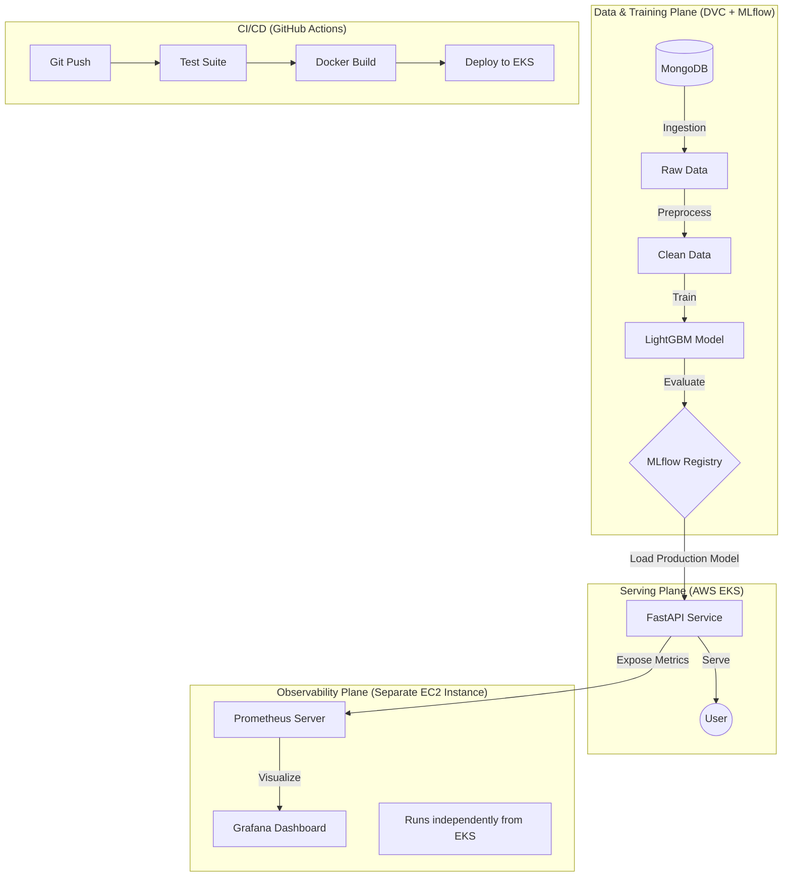
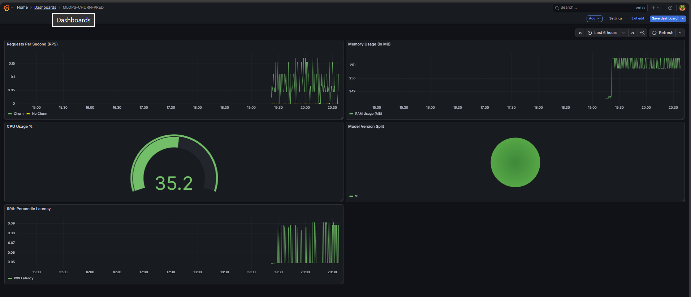
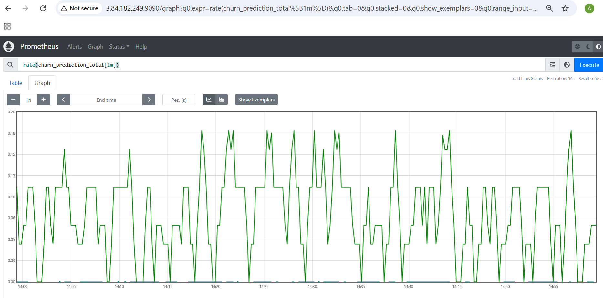

# 📉 End-to-End MLOps Customer Churn Prediction

      

> **🚀 Key Features:**
> *   **Automated Promotion**: Metric-based (F1-Score) auto-promotion to Staging & Production.
> *   **Cloud Native**: Fully deployed on **AWS EKS** with Docker ECR.
> *   **ObservabilityStack**: Real-time Monitoring via **Prometheus & Grafana**.
> *   **Engineering**: Modular, Scalable, & Defensive Code with **Centralized Logging**.
> *   **Data Ops**: Remote Integration (MongoDB) & DVC Versioning.
---

## 📖 Table of Contents
1. [Executive Summary](#-executive-summary)
2. [Business Problem](#-business-problem)
3. [System Architecture](#-system-architecture)
4. [The MLOps Workflow (A-to-Z)](#-the-mlops-workflow-a-to-z)
    - [Data Ingestion](#phase-1-data-ingestion)
    - [Transformation & Feature Engineering](#phase-2-transformation--feature-engineering)
    - [Model Training (LightGBM)](#phase-3-model-training)
    - [Evaluation & Champion/Challenger](#phase-4-evaluation--championchallenger)
5. [Operationalization (DevOps)](#-operationalization-devops)
    - [CI/CD Pipeline](#1-cicd-pipeline-github-actions)
    - [Containerization](#2-marketing-containerization-docker)
    - [Deployment (AWS EKS)](#3-deployment-aws-eks)
6. [Monitoring & Observability](#-monitoring--observability)
    - [Grafana Dashboards](#1-grafana-dashboards)
    - [Prometheus Metrics](#2-prometheus-metrics)
7. [Installation & Usage](#-installation--usage)
8. [API Reference](#-api-reference)

---

## 📋 Executive Summary
This project is a complete, industrial-grade **MLOps (Machine Learning Operations)** solution designed to predict customer churn in real-time. Unlike simple "notebook" projects, this system addresses the full lifecycle of ML software, focusing on **Reproducibility**, **Automation**, and **Observability**.

It features a **LightGBM** model wrapped in a FastAPI service, containerized with Docker, deployed on a **Kubernetes (EKS)** cluster, and monitored via **Prometheus & Grafana**. All changes are orchestrated via **DVC** and **GitHub Actions**.

---

## 💼 Business Problem
**Customer Churn** is a critical metric for subscription-based businesses (Telecom, SaaS). Acquiring a new customer is 5-25x more expensive than retaining an existing one.

*   **Goal**: Predict which customers are likely to cancel their service in the next month.
*   **Action**: Usage of this API allows the "Retention Team" to proactively offer discounts or support to high-risk customers *before* they leave.
*   **Metric**: We optimize for **F1-Score** (Balanced Precision/Recall) because False Negatives (missing a churner) are costly, but False Positives (giving discounts to happy users) are also wasteful.

---

## 🏗 System Architecture

The system follows a microservice-oriented MLOps architecture.



---

## 🔄 The MLOps Workflow (A-to-Z)
The core ML pipeline is orchestrated by **DVC (Data Version Control)** to ensure reproducibility.

### Phase 1: Data Ingestion
*   **Source**: MongoDB (Flexible NoSQL storage).
*   **Process**: Data is extracted, validated against a schema, and saved as `artifacts/data_ingestion/churn.csv`.
*   **Versioning**: The raw hash is tracked in `dvc.lock`, ensuring strict data lineage.

### Phase 2: Transformation & Feature Engineering
*   **Handling Missing Values**: Imputation strategies applied.
*   **Encoding**: 
    *   Categorical variables (e.g., `PaymentMethod`) are LabelEncoded.
    *   Numerical variables are Scaled.
*   **Artifacts**: A `preprocessor.pkl` object is saved. This is **CRITICAL**—the exact same scaling logic used in training must be used in inference.

### Phase 3: Model Training
*   **Algorithm**: **LightGBM** (Light Gradient Boosting Machine).
*   **Why LightGBM?**: Faster training speed and higher efficiency than XGBoost for tabular data.
*   **Hyperparameters** (Versioning in `params.yaml`):
    *   `n_estimators`: 200
    *   `learning_rate`: 0.1
    *   `class_weight`: "balanced" (Crucial for handling class imbalance in churn data).
*   **Pipeline**: The Preprocessor and Model are bundled into a single `sklearn.Pipeline` object to prevent data leakage.

### Phase 4: Automated Evaluation & Promotion
*   **Matrix-Based Promotion**: The pipeline implements a strict **Metric Gateway**.
*   **Champion/Challenger Logic**:
    1.  **Challenger**: The newly trained model is evaluated on the test set.
    2.  **Champion**: The current `@Production` model is fetched from MLflow.
    3.  **Approve**: If `Challenger_F1 > Champion_F1`, the new model is automatically promoted to **Staging** and then **Production**.
    4.  **Reject**: If the new model underperforms, the pipeline halts. **No bad model ever reaches EKS.**

---

## 💻 Engineering Best Practices
This codebase is structured to meet enterprise standards, not just for functionality but for maintainability.

### 1. Defensive Programming
*   **Decorator Pattern**: Used `@ensure_annotations` in `src/utils/common.py` to enforce strict type checking at runtime, catching silent data type bugs early.
*   **Custom Exception Handling**: A centralized `ChurnException` class (wrapping Python's `Exception`) captures detailed error stacks, including file names and line numbers, making debugging effortless in production.

### 2. Centralized Logging
*   **Dual-Stream Logging**: All components use a unified `churnLogger`.
*   **Output**: Logs are streamed to both the Console (for real-time debugging) and File (for persistent audit trails in `logs/running_logs.log`).

### 3. ConfigBox & Hydra-Like Configs
*   **Problem**: Python dictionaries require bracket access (`d['key']`), which is verbose and error-prone.
*   **Solution**: We utilize `ConfigBox`, allowing dot-notation access (`d.key`). Configuration is cleanly separated from code using YAML files.

### 4. Singleton Pattern (Database)
*   **Efficiency**: `src/connection/mongodb_client.py` implements the Singleton pattern (`client` class attribute) to ensure only **one** database connection is created per application instance, preventing connection exhaust in high-load scenarios.

---

## ⚙️ Operationalization (DevOps)

### 1. CI/CD Pipeline (GitHub Actions)
Every code push triggers `ci.yaml`:
1.  **DVC Repro**: Reproduces the entire training pipeline to ensure code integrity.
2.  **Model/Integration Tests**: Validates the model artifacts.
3.  **AWS Integration**: Authenticates via OIDC/Secrets.
4.  **Continuous Deployment**: Updates the EKS cluster with zero downtime.

### 2. Container Registry (AWS ECR)
*   **Docker Build**: We use a **Multi-Stage Build** to create a lightweight (< 500MB) image.
*   **ECR Push**: On successful tests, the image is tagged and pushed to **AWS Elastic Container Registry (ECR)**.
*   **Versioning**: Each image is tagged with the Git Commit SHA for traceability.

### 3. Deployment (AWS EKS)
*   **Infrastructure**: Managed Kubernetes Service (EKS).
*   **Scalability**: Auto-scaling Node Groups (`t3.small`).
*   **Reliability**: `LoadBalancer` Service type distributes traffic across multiple Replicas.

---

## 📊 Monitoring & Observability
We strictly implemented observability to ensure "Day 2" operations success.

### 1. Grafana Dashboards
**Real-time Business Insights**

*   **RPS (Requests/Sec)**: Understanding traffic spikes.
*   **Model Drift**: Visualizing the "Confidence Histogram" to detect if the model is becoming uncertain.

### 2. Prometheus Metrics
**Raw Metric Scraper**

*   Custom endpoint `/metrics` created using `prometheus_fastapi_instrumentator`.
*   Exposes `churn_prediction_total`, `prediction_latency_seconds`, and process health metrics.

---

## ⚡ Installation & Usage

### Prerequisites
*   Python 3.8+
*   Docker & Kubernetes (docket-desktop / minikube)
*   AWS CLI (configured)

### Local Setup
```bash
# 1. Clone
git clone https://github.com/your-username/MLOPS-CHURN-PRED.git
cd MLOPS-CHURN-PRED

# 2. Install
pip install -r requirements.txt

# 3. Train Pipeline
dvc repro

# 4. Run API
uvicorn app.main:app --reload
```

---

## 📡 API Reference

### 1. Predict Churn (`POST /predict`)
Get a real-time prediction for a customer.

**Request:**
```json
{
  "tenure": 24,
  "monthly_charges": 85.0,
  "total_charges": 2040.0,
  "contract": "One year",
  "payment_method": "Credit card (automatic)",
  "internet_service": "Fiber optic",
  "tech_support": "Yes",
  "online_security": "No",
  "support_calls": 0
}
```

**Response:**
```json
{
  "prediction": "No Churn",
  "probability": 0.12
}
```

### 2. Metrics (`GET /metrics`)
Returns Prometheus-formatted metrics for scraping.

---

